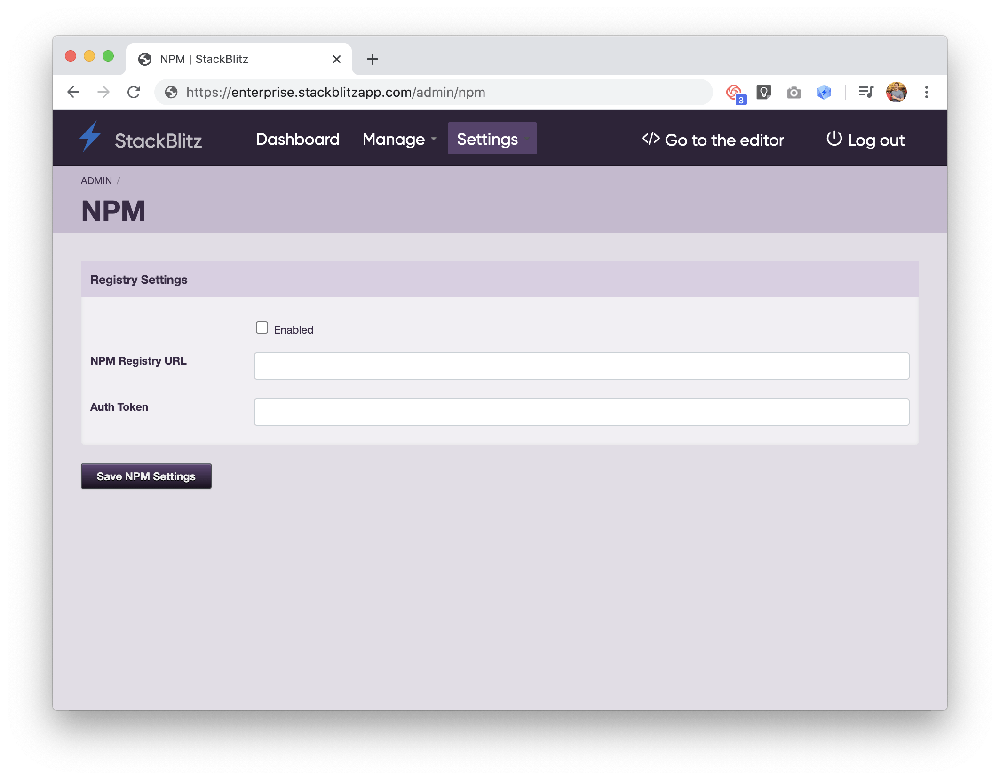

# {{ $frontmatter.title }}

Qi X Lab is excited to offer custom npm registry support to organizations using Qi X Lab COOPERATIONS Edition (EE). To enable this feature, you need to be logged in as an admin. If your npm registry requires authentication, you may need to coordinate with the manager of your npm administration before proceeding.

By default, Qi X Lab EE points at the public npm registry. You can configure Qi X Lab EE to point at your own internal registry, even if authentication is required. Additionally, Qi X Lab npm integration is designed to work with the third party registries like Artifactory.

## Linking your registry

In the Qi X Lab Admin panel header, hover over "Settings" and click on "npm". This will take you to the "NPM Settings" page:

To start, check the "enabled" box. Then, fill in the URL of your npm registry.

If your registry requires an authorization token for access, you'll need to generate a token and provide it in the "Auth Token" field.

When completed, click "Save NPM Settings".
