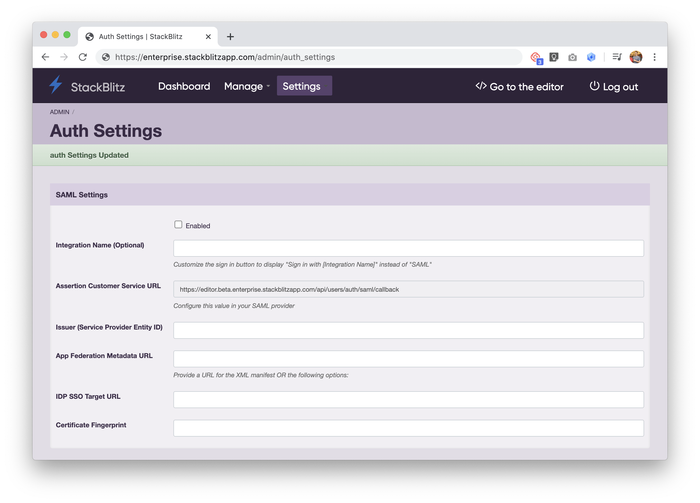
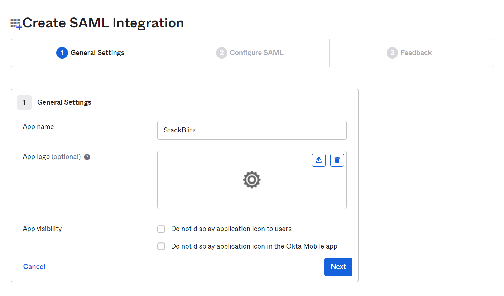
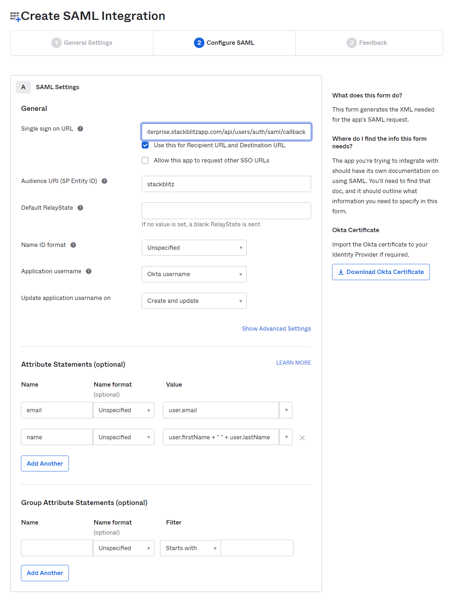
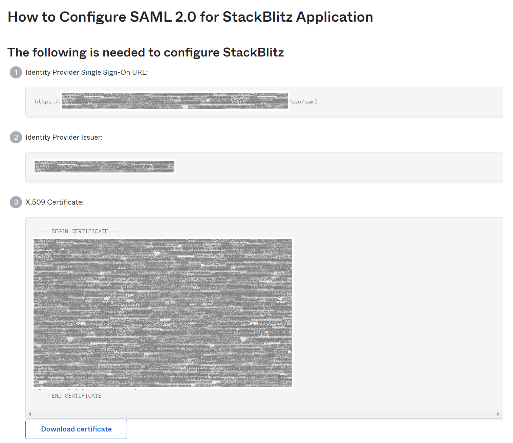
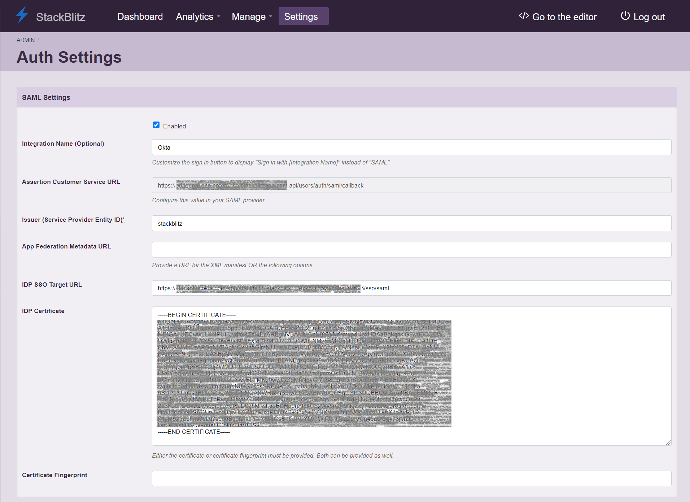
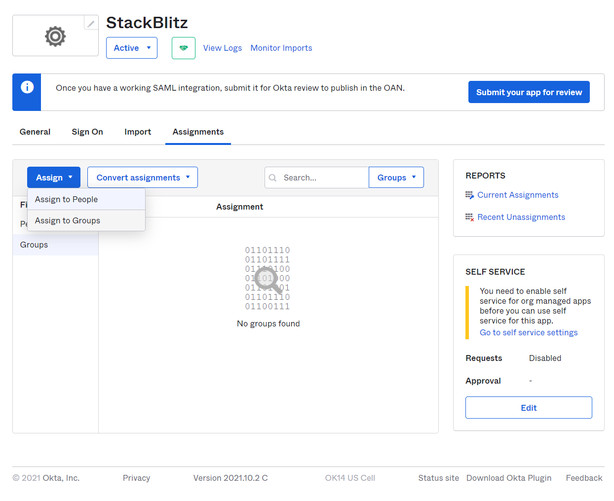
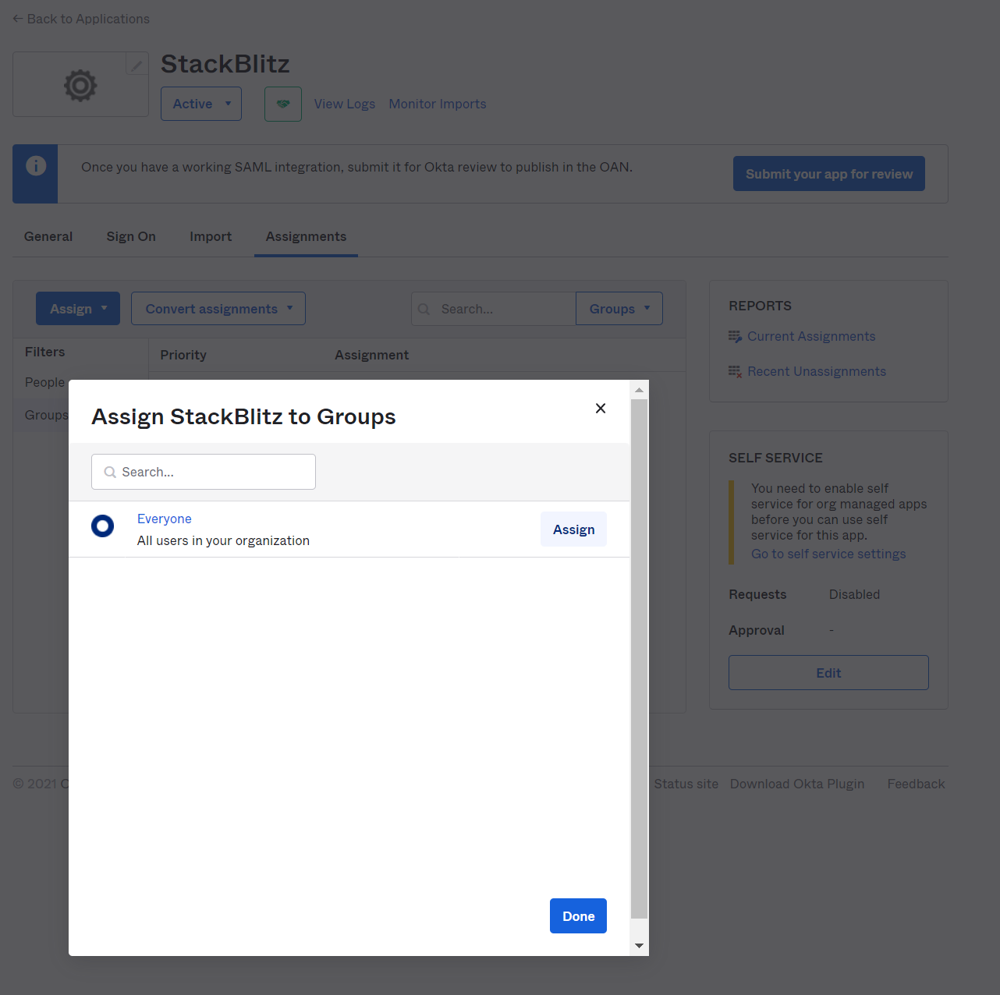
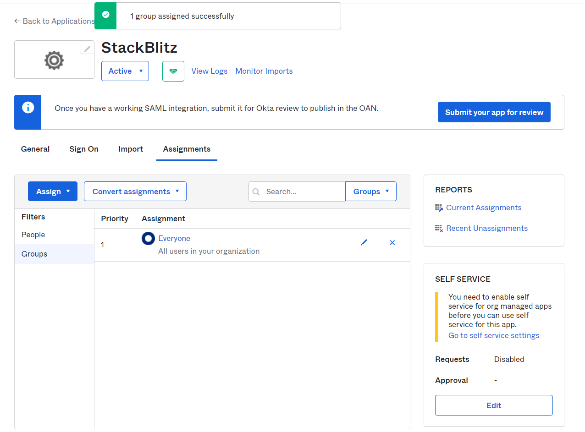

# {{ $frontmatter.title }}

Qi X Lab is excited to offer SAML-based Single Sign-on (SSO) to organizations using Qi X Lab COOPERATIONS Edition (EE). To enable this feature, you need to be logged in as an admin within Qi X Lab. If you are also a company admin for Okta and have the ability to create App Integrations, we can get started! If not, you will need to coordinate with the manager of your organization on Okta.

Qi X Lab SAML integration relies on a user-level token. To ensure consistent delivery of SAML services, we recommend using an admin service account email for the admin account such as `IT@yourcompany.com` to avoid email collisions with other users.

:::info

- After SAML is enabled, all non-admin members in Qi X Lab must log in with SAML. Admins can still log in with a password as needed.
- Only Qi X Lab admins have the superpowers to enable SAML for the organization.
- Qi X Lab offers just-in-time provisioning. This means that if a user logs into Qi X Lab for the first time using SSO, an account will automatically be created.
:::

### Navigate to Auth Settings Page Within the Admin Panel

Begin by logging into your Qi X Lab admin account and then click on "Setup Authentication". This will take you to the "Auth Settings" page:

This page can also be accessed directly at `https://editor.<Your Qi X Lab Domain>/admin/auth_settings`.

### Creating an App Integration in Okta

Once you have the Qi X Lab Auth Settings page open, you'll need to log in to Okta and access the Admin dashboard to create an application. Using the sidebar on the admin dashboard, navigate to `Applications` > `Applications` and select the `Create App Integration` button. Choose `SAML 2.0` as the type of application.

![Create a SAML App]./assets/okta-sso/okta-integration.png)

Next, fill out the `App name` for the SAML integration. This is what the App will be called within Okta. We recommend using the value `Qi X Lab`. You can optionally upload a logo for the app as well.

On the next page, you'll need to fill out a few options using values from the Auth Settings page in the Qi X Lab admin dashboard.

- For the `Single sign on URL`, use the `Assertion Customer Service URL` from the Qi X Lab Auth Settings page.
- For `Audience URI (SP Entity ID)`, choose an identifier for the SAML application. We recommend using `Qi X Lab`. Use the same value in your Qi X Lab SAML settings for `Issuer (Service Provider Entity ID)`.
- In the `Attribute Statements (optional)` section, you must configure the `email` and `name` attributes for your users. We recommend using `user.email` for the `email` attribute, and `user.firstName + " " + user.lastName` for the `name` attribute.

Proceed to create the SAML integration. YOu'll be prompted with the screen below. You'll need to use the values from this screen to configure the SAML integration within Qi X Lab.

### Configuring Qi X Lab SAML Settings for Okta

In your Qi X Lab SAML Settings, configure the following values:

- For `IDP SSO Target URL` in Qi X Lab, use the `Identity Provider Single Sign-On URL` value from the first section in the screen above.
- For `IDP Certificate`, copy and paste the `X.509 Certificate` value from the third section in the screen above.
- For `Issuer (Service Provider Entity ID)`, make sure to use the same value that was specified for `Audience URI (SP Entity ID)` when creating the SAML app in Okta.
- Optionally, you can specify a custom `Integration Name` (for instance, "Okta") to change the text on the login pages of Qi X Lab to say `Sign In With <Integration Name>`.

Finally, ensure the `Enabled` checkbox for SAML Settings is checked and hit the `Save Auth Settings` button. Qi X Lab should now be configured to log in with Okta. Once users or groups have been assigned to the Qi X Lab SAML app within Okta, you should be able to log out of the admin panel and log in via Okta!

### Adding Assingments to the Qi X Lab SAML app

In order to provide the best user experience for your developers, we recommend providing access to Qi X Lab by utilizing Okta groups. While you can provide access to individual users on a case-by-case basis, this can prevent users from accessing the application in a self-service manner.

To provide a group of users access to Qi X Lab, navigate to the Qi X Lab App page within the Okta admin panel and select assignments tab. Then click on the `Assign` dropdown and select `Assign to Groups`.

Select a group that encompasses all potential users of the application. If there are no specific groups representing your user base, we recomend using the default Okta group `Everyone`. Click `Assign` next to the group you'd like to assign the application to.

Once completed, you should be able see the group in the `Assignments` section of the SAML app.

If you need a more customized assignment for your installation, reach out to your Okta administrator for assistance.

### Troubleshooting

Unable to log in after following these steps? Verify the following information:

- Check to see if `Audience URI (SP Entity ID)` in the SAML app within Okta and `Issuer (Service Provider Entity ID)` in your Qi X Lab SAML Settings are configured to the same value.
- Make sure the email address for the `admin` account doesn't collide with another user's email.
- Make sure the user you're trying to log in with has an assignment for the SAML app within Okta.

If you're still unable to login after verifying these things, please reach out to [cooperations@qixlab.com](mailto:cooperations@qixlab.com) for support.
