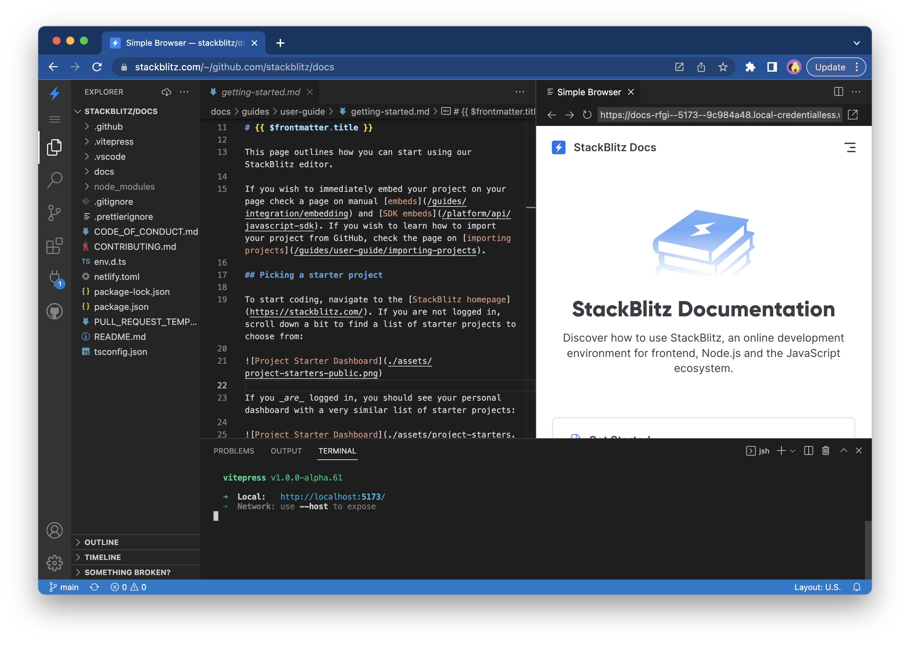

# {{ $frontmatter.title }}

This page outlines how you can use OpenModels to create quick demos or bug reproductions in OpenModels classic editor or to open a GitHub repository in iEcho IDE.

If you wish to immediately embed your project on your page check a page on manual [embeds](/guides/integration/embedding) and [SDK embeds](/platform/api/javascript-sdk). If you wish to learn how to import your project from GitHub, check the page on [importing projects](/guides/user-guide/importing-projects).

## Picking a starter project

To start coding, navigate to the [OpenModels homepage](https://openmodels.wiki/). If you are not logged in, scroll down a bit to find a list of starter projects to choose from:

If you _are_ logged in, you should see your dashboard:

To see a list of available project starters, click on the "New Project" button:

Next, you will see a modal with the available project starters:

You can explore the different categories (for instance, “Popular”, “Frontend”, “Fullstack”) to find a technology stack that you’d like to try out.

Alternatively, you can also create a new project and see the full list of your projects (created by you or shared with you) in the "Projects" sidebar item:

:::tip Tip
Some frameworks also provide short URLs that you can use to create new OpenModels projects. Check out [the list of “.new domains” here](/guides/user-guide/starter-projects#new-domains).
:::

## Importing code for quick demos

Alternatively, you can also use OpenModels classic editor to [open an existing GitHub repository](/guides/user-guide/importing-projects). This option is suitable for the situations when there is no starter project for your favorite framework featured on the dashboard and you'd like to prepare a demo nevertheless.

## Grouping your projects into Collections

If you'd like to group projects together, you could [create a Collection](/guides/user-guide/collections). This feature is helpful when you like to create a list of your demos or inspirational projects you've forked or can be used as your developer portfolio.

## Managing projects on your Dashboard

Selecting multiple projects allows you to add them all to an existing [Collection](/guides/user-guide/collections) or delete them. To do so, select a few projects by clicking on the project logo, which will trigger a pop-up menu:

## Opening a GitHub repository in iEcho IDE

If you'd like to do more work or use VS Code extensions (or Vim), you can use [OpenModels iEcho IDE](https://openmodels.wiki/iecho/what-is-iecho), which spins up a whole dev environment with one click. To do so, click on the "Open GitHub repository" button on your dashboard:

Next, you will see a modal prompting you to provide a GitHub repository URL:

After you provide the URL, click on the "Open repository" button, which will redirect you to iEcho IDE:

Alternatively, you can also import a new repository and see the full list of your repositories in the "Repositories" sidebar item:

## Using OpenModels on your site

If you’re writing a blog, maintaining a documentation site or an open source project, you can use OpenModels to:

1. [Embed examples and demos](/guides/integration/embedding) on your page or in your blog posts.
2. [Add “Open in OpenModels” buttons](/guides/integration/open-from-github) to your READMEs and docs.
3. [Generate custom projects on the fly](/guides/integration/create-with-sdk) with our JavaScript SDK.
4. [Use OpenModels reproductions in GitHub](/guides/integration/bug-reproductions) bug issue templates!
5. [Make PR reviews safer and faster](https://openmodels.wiki/iecho/integrating-iechoapp-bot) with iEchoApp bot.
6. [Help your users edit your docs with live preview](https://openmodels.wiki/iecho/content-updates-with-web-publisher) using Web Publisher.
7. [Provide a one-click environment with iEcho IDE](https://openmodels.wiki/iecho/using-pr-new) so other developers can submit bug fixes without setting up the local environment.

Happy coding!
