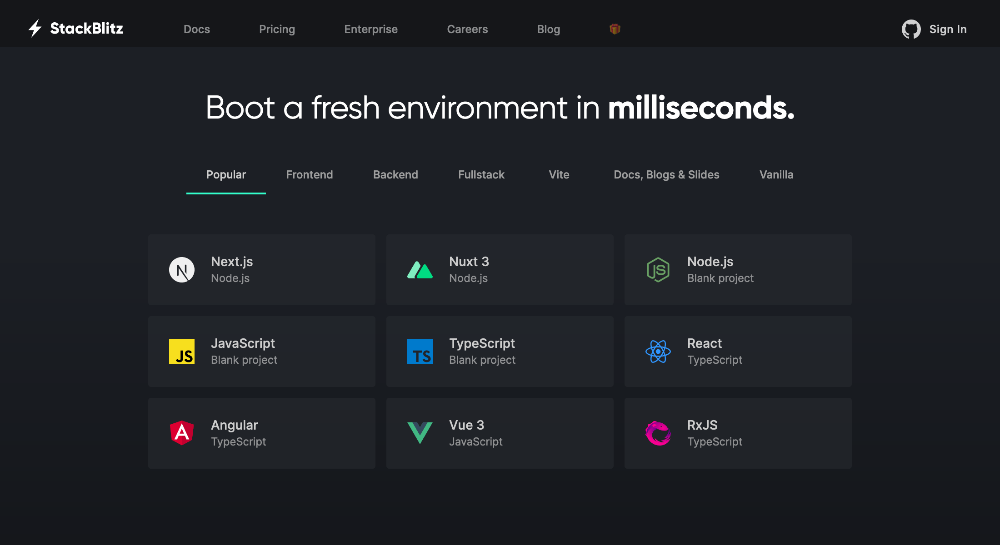
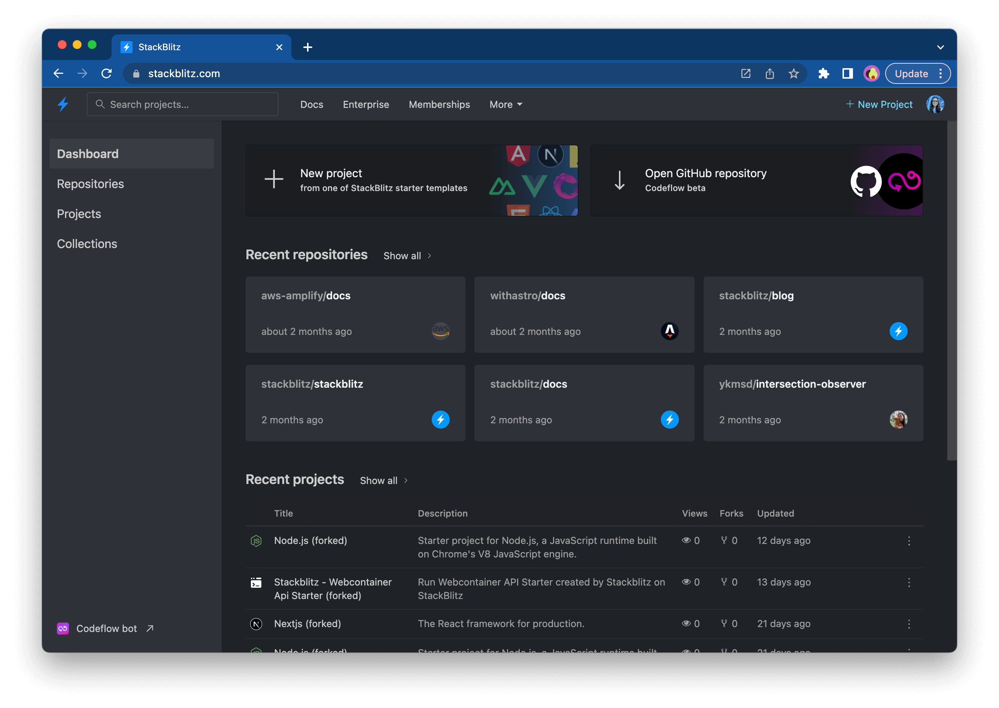
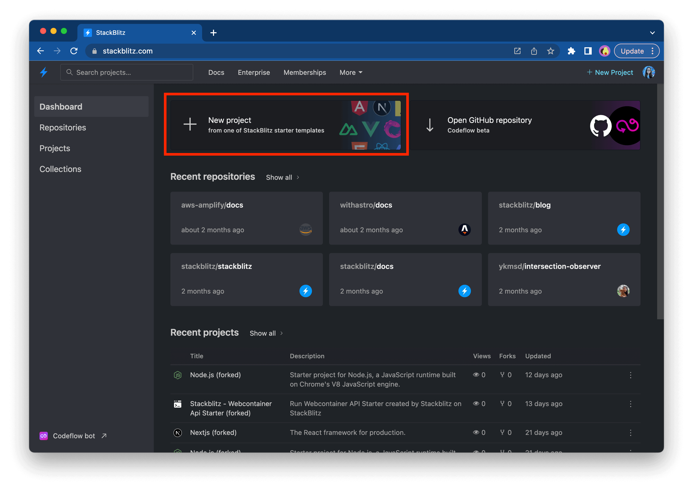
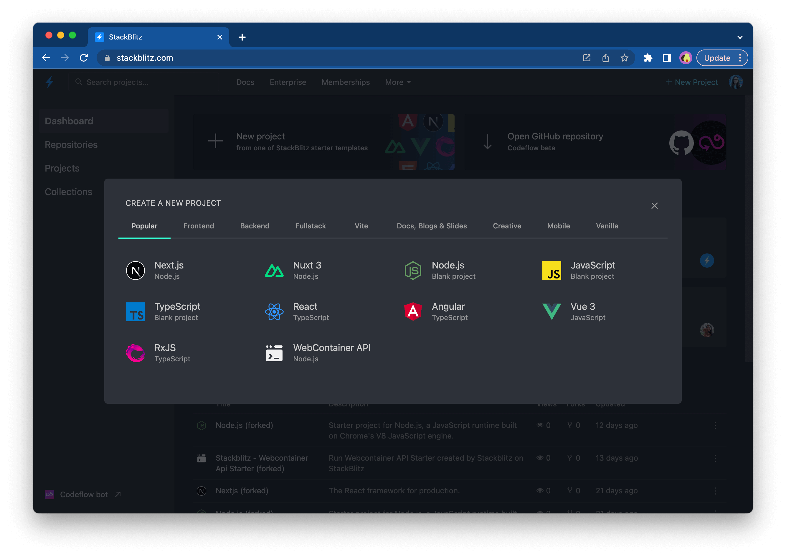
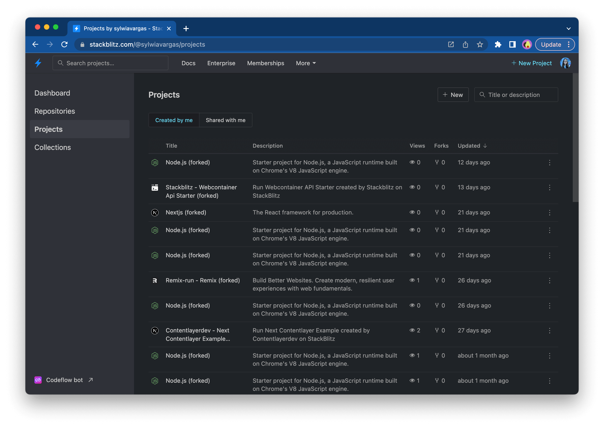
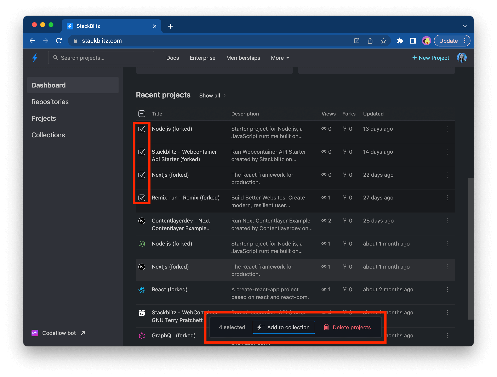
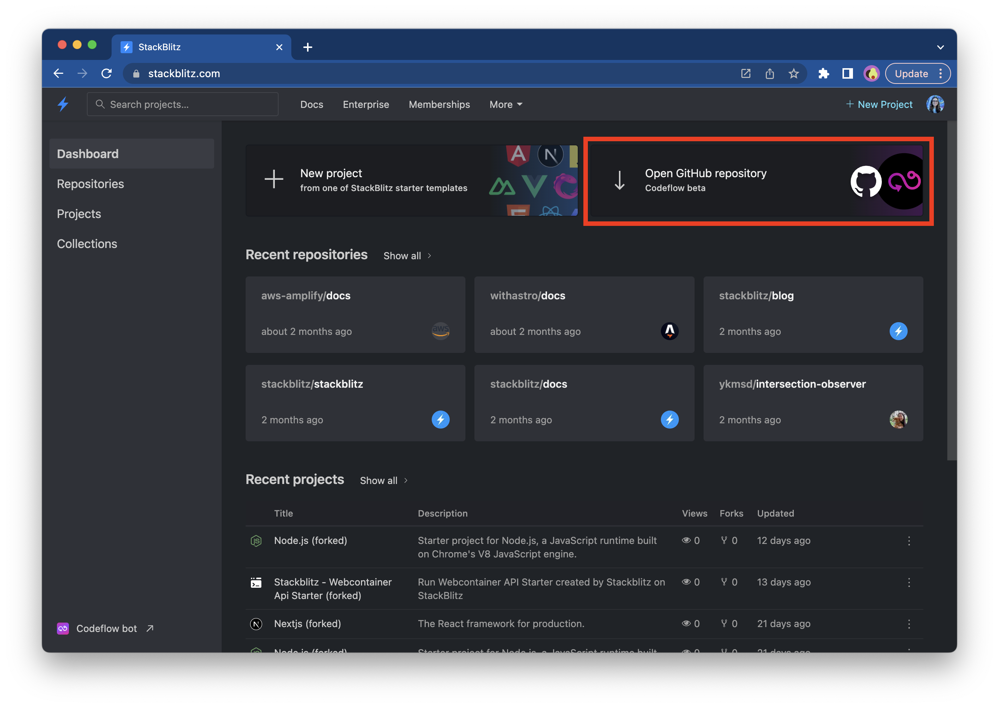
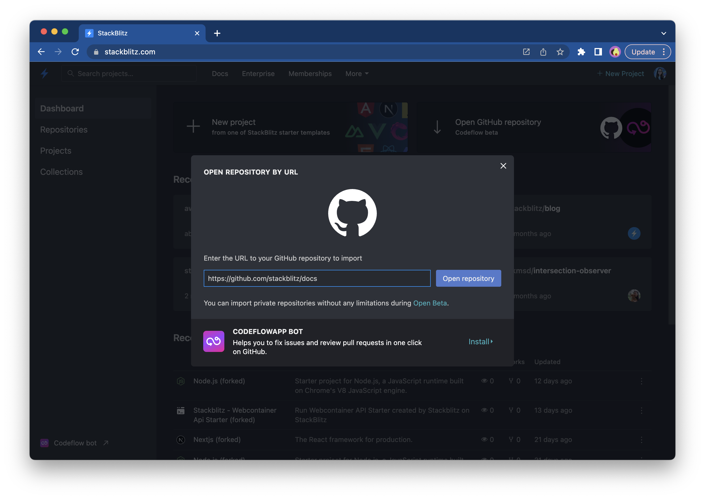
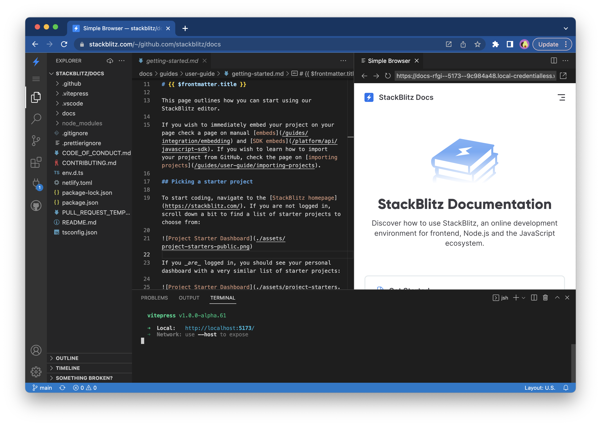
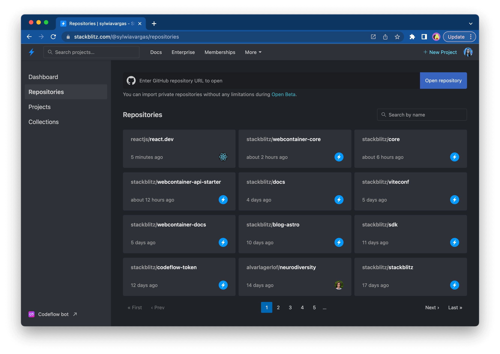

# {{ $frontmatter.title }}

This page outlines how you can use Qi X Lab to create quick demos or bug reproductions in Qi X Lab classic editor or to open a GitHub repository in RESEARCH IDE.

## Picking a starter project

To start coding, navigate to the [Qi X Lab homepage](https://qixlab.com/). If you are not logged in, scroll down a bit to find a list of starter projects to choose from:

If you _are_ logged in, you should see your dashboard:

To see a list of available project starters, click on the "New Project" button:

Next, you will see a modal with the available project starters:

You can explore the different categories (for instance, “Popular”, “Frontend”, “Fullstack”) to find a technology stack that you’d like to try out.

Alternatively, you can also create a new project and see the full list of your projects (created by you or shared with you) in the "Projects" sidebar item:

:::tip Tip
Some frameworks also provide short URLs that you can use to create new Qi X Lab projects. Check out [the list of “.new domains” here](/home/user-guide/starter-projects#new-domains).
:::

## Importing code for quick demos

Alternatively, you can also use Qi X Lab classic editor to [open an existing GitHub repository](/home/user-guide/importing-projects). This option is suitable for the situations when there is no starter project for your favorite framework featured on the dashboard and you'd like to prepare a demo nevertheless.

## Grouping your projects into Collections

If you'd like to group projects together, you could [create a Collection](/home/user-guide/collections). This feature is helpful when you like to create a list of your demos or inspirational projects you've forked or can be used as your developer portfolio.

## Managing projects on your Dashboard

Selecting multiple projects allows you to add them all to an existing [Collection](/home/user-guide/collections) or delete them. To do so, select a few projects by clicking on the project logo, which will trigger a pop-up menu:

## Opening a GitHub repository in RESEARCH IDE

If you'd like to do more work or use VS Code extensions (or Vim), you can use [Qi X Lab RESEARCH IDE](https://qixlab.com/research/what-is-research), which spins up a whole dev environment with one click. To do so, click on the "Open GitHub repository" button on your dashboard:

Next, you will see a modal prompting you to provide a GitHub repository URL:

After you provide the URL, click on the "Open repository" button, which will redirect you to RESEARCH IDE:

Alternatively, you can also import a new repository and see the full list of your repositories in the "Repositories" sidebar item:

## Using Qi X Lab on your site

If you’re writing a blog, maintaining a documentation site or an open source project, you can use Qi X Lab to:

Happy coding!
