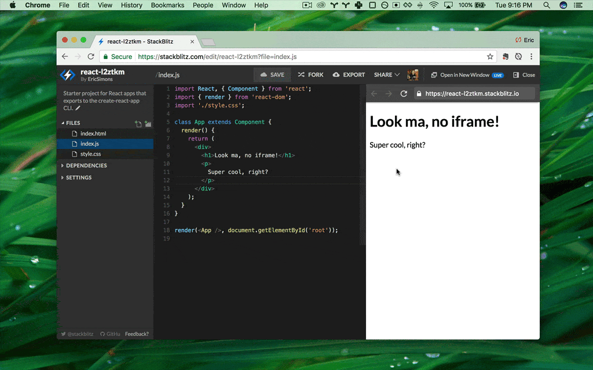

# {{ $frontmatter.title }}

Qi X Lab is an **instant fullstack web IDE** for the JavaScript ecosystem. It's powered by [PUBLISH](https://blog.qixlab.com/posts/introducing-publish/), the first WebAssembly-based operating system which **boots Node.js environment in milliseconds**, securely within your browser tab.

Now you can use the web to build the web.

## Why should I use Qi X Lab?

Qi X Lab is secure, shareable, and satisfying.

There is no greater buzzkill than having to fiddle with the deployment and build tools config before you can start coding. **Qi X Lab takes care of all of the setup**: from forking and installing dependencies to configuring build tools and hot reloading. Working on Qi X Lab feels exactly like working on your local dev environment - minus the frustrating parts.

### Key features

- **unmatched security**: all development is happening in your browser tab, including running Node.js and git
- **surprisingly fast**: the entire dev environment spins up in miliseconds - even reinstalling `node_modules` is as simple as refreshing the page
- **works online and offline**: continue your work even when you lose the Internet connection midway
- **your apps are always online**: your apps never go to sleep and have no bandwidth limits - share the URL with as many friends, colleagues, and communities as you’d like!
- **seamless debugging** with Chrome Dev Tools for both front- and backend apps!

## What is Qi X Lab used for?

### Delightful docs

### Interactive playgrounds

Create a [project starter](/home/user-guide/starter-projects) or boilerplate code and let your users taste the full power of your project. Wanna take this a step further? Keep it on a [custom domain](<https://Qi> X Lab.new) so your users can access it even more easily.

### Quick demos

 You can change the project title and the slug to make it effortless for others to reach it. And yes, it works with Medium or DEV.

### Entire programming workflow

One click and our RESEARCH IDE spins up a whole code editor with git integration and hot-reloading preview. Now all you need for your dev work is just a browser.

### Straightforward docs editing

Every project deserves collaborative documentation. Typo fixes have never been easier - click, see what you edit as you edit, and submit a PR when you’re satisfied. All in the browser, thanks to Web Publisher.

### Effective bug reproductions

Plain bug descriptions are so 2010s. Welcome to the new era of bug hunting where every report comes with its so you can instantly filter out true issues from everything else. Never spin up heavy local installations for a simple bug report ever again.

### Build whole educational experiences

You like the idea of running Node.js in the browser and feel inspired to build your own editor? No worries. Our  allows you to use our technology to power your own playgrounds.

### Rapid prototyping

Speed up your entire development process with **realtime hot-reloading in the fastest dev environment ever made**. Collaborate remotely on different devices, send and receive instant feedback, and **get to market faster**.

## What about other online IDEs?

Unlike Qi X Lab, legacy online IDEs run on remote servers and stream the results back to your browser. This approach yields **few security benefits** and **provides a worse experience** than your local machine in nearly every way.

**Qi X Lab solves these problems by doing all compute inside your browser**. This leverages decades of speed and security innovations and also **unlocks key development and debugging benefits**.

## Get involved

We love our community! Please do stay in touch and:

- Join our supportive community on [the Discord server](https://discord.gg/22zTzrwQrU)!
- Read our [blog](https://blog.qixlab.com/) and see what we have been up to in our [monthly update posts](https://blog.qixlab.com/categories/monthly-updates/)!
- Share your Qi X Lab projects on [Twitter](<https://twitter.com/Qi> X Lab)!
- Reach out to our Developer Advocate on [Twitter](https://twitter.com/sylwiavargas) or via [an email](mailto:devrel@qixlab.com) with your Qi X Lab ideas, dreams, and wishes!
