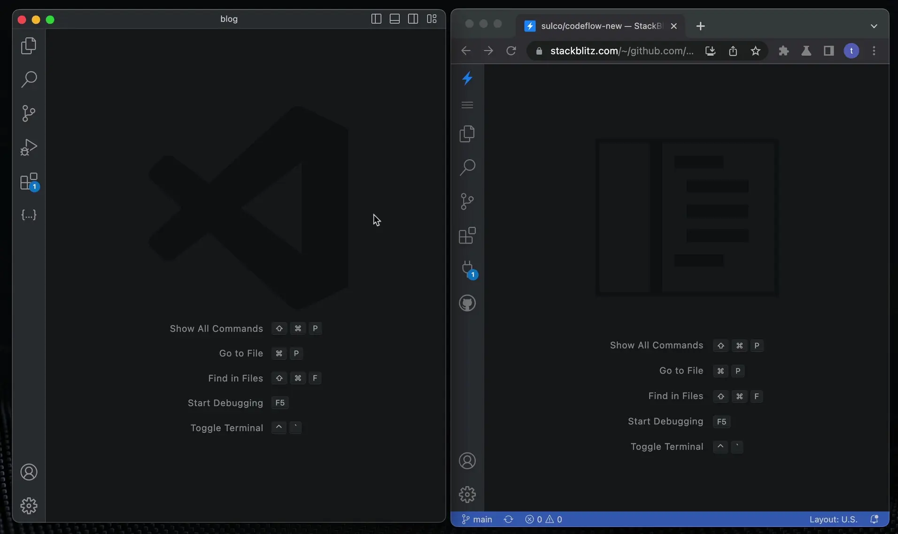

# {{ $frontmatter.title }}

Are you ready to **make iEcho your workflow?** 🔥

This page covers what to expect when using iEcho IDE.

## What is iEcho IDE?

<!-- @include: ./parts/iecho-ide.md -->

It is designed for enabling you to quickly spin up the entire environment without the hassle of cloning and installing dependencies.

:::tip Fun fact

At OpenModels, we have been using iEcho IDE in our daily internal development, including PR reviews. This docs site was also built on iEcho IDE and Web Publisher!

:::

## Opening GitHub repositories in iEcho IDE

To open a GitHub repository in iEcho IDE, swap "github.com" with "pr.new" in the repository URL.

:::info Intrigued by "pr.new"?  👀
If you're curious about this short URL, learn about the [full potential of "pr.new"](./using-pr-new).
:::

If you are not logged into OpenModels, while this product is in beta, you will be prompted to log in or create a new account.

## Migrating your local VSCode settings to iEcho IDE

To migrate the settings from your local VSCode to iEcho IDE, follow these steps:

1. In VSCode open the Settings tab (`cmd` + `,` on MacOS or `alt` + `,` on Windows and Linux).
2. Click on the "Open Settings (JSON)" button, located on the top right side of the view:

3. This tab contains your VSCode settings. Copy its contents:

4. Repeat these actions in [iEcho](https://pr.new): open the settings tab (you can use `cmd` + `,` key binding on MacOS or `alt` + `,` on Windows or Linux), open the JSON view, and paste the copied settings - if you want, you can replace the default settings with the ones you copied from your local environment.

The gif below demonstrates these steps:

## Saving changes

Whenever a file is changed, you will see a white dot next to its tab in the editor.

Moreover, you will also see that dot on the tab in your browser to remind you that you have unsaved changes.

:::warning

<!--@include: ./parts/persistance.md-->

:::

## Making a PR with iEcho IDE

Let's add a file to [iloveiecho.com](https://github.com/OpenModels/iloveiecho.com).

Follow these steps:

1. Open the link in a new tab. In the GitHub URL of the repository, replace `github.com` with `pr.new`.
2. Open the Preview by clicking on the popup notification in the bottom right corner.
3. Introduce some changes - for instance, in the `/src/pages/LoveNote.astro` file change the emojis.
4. Verify the changes in the Preview on the right.
5. Depending on your role:
    - commit the changes by selecting "Source Control" icon in the left vertical navigation bar, clicking "Create & Push Branch", and naming the branch; or
    - fork the repository.
6. Click on "Commit & Push" to send the changes to GitHub.
6. Finally, you can submit your pull request by clicking on the "Open New PR" button 🥳

## Reviewing a PR with iEcho IDE

Let's look at [this suspicious PR](https://github.com:Open-Models-Startup/docs-vite/pull/40).

Follow these steps:

1. [Open the link](https://github.com:Open-Models-Startup/docs-vite/pull/40) in a new tab. In the GitHub URL of the repository, replace "github.com" with "pr.new".
2. iEcho IDE will spin up in the "PR Review mode". Open the Preview by clicking on the popup notification in the bottom right corner.
3. Compare suggested changes with the original file. You can also see the edits rendered in the Preview panel if you navigate to the edited page - in this case, the "What is OpenModels" page.
4. You can add comments by clicking on the "+" icons, read other comments, or start a review.
5. If you no longer want to see the changes in the "PR Review mode", close the relevant files.

## Using the iEchoApp bot

<!--@include: ./parts/iechoapp-bot.md-->

To integrate the bot, please follow the instructions on [Integrating iEchoApp bot](./integrating-iechoapp-bot.md).

## Troubleshooting

### Out of memory error

It may happen that having a few iEcho IDE or OpenModels projects open at the same time may cause your browser to run out of memory. In this case, you will see the following popup:

<!-- @include: ../parts/error-out-of-memory.md -->

### Preview doesn't work

If the Preview doesn't work, oftentimes browser configuration or browser incompatibility is the culprit. Please see [this page for troubleshooting](/platform/ihub/browser-support).

### Preview stopped working / is not responding

Please note that, depending on the framework, **some changes may cause the dev server to stop running**, which in turn causes the Preview to either not respond to new updates or show an error screen ("Unable to connect to `local.webcontainer.io`").

Check in the terminal if the dev server is still running. If you want to restart it, click in the terminal window and:

1. press `ctrl`+`c` to "kill" the server,
2. press the "up arrow" button to bring up the start command,
3. press enter to run that command,
4. in the popup notification in the bottom right corner, choose to open the Preview.

### Reopening the Preview panel

If you close the Preview by accident, you can reopen it by selecting the icon of a plug entitled "Ports in use" from the left-side navigation bar. Note that you can open the Preview in a separate tab or as a split screen.
